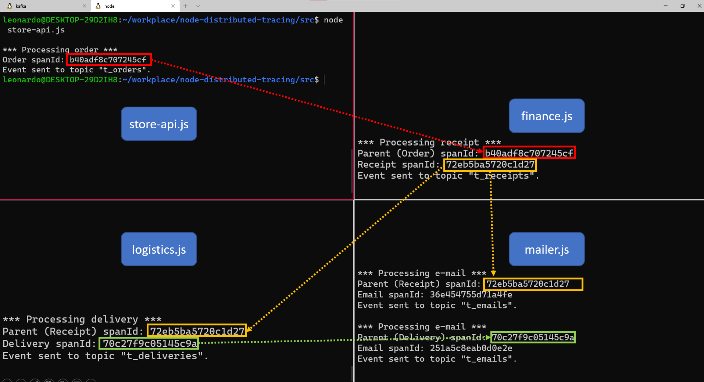

# POC - Distributed Tracing for microservices Kafka based communication using Jaeger

## Understanding the data flow

The POC is a group of four microservices using event sourcing to communicate what is happening in each context.


The main `js` files are:
- `store-api.js`: simulation of a API, receiving order info and writing it in a _t_orders_ topic.
- `finance.js`: simulation of a service that consumes _t_orders_, do something related to finance rules, and then write new info in a _t_receipts_ topic.
- `logistics.js`: simulation of a logistics service consuming _t_receipts_ topic, doing some delivery tasks and writing a new message in _t_deliveries_ topic.
- `mailer.js`: this communication service consumes two different topics, _t_receipts_ and _t_deliveries_, and reacts to these two events producing a new message it _t_emails_ topic for each message handled.

***

## Set up the environment

### Kafka
I did this POC using Zookeeper and Kafka running on my machine. It's possible do it following the steps 1 and 2 in this tutorial: https://kafka.apache.org/quickstart  
To wrap up, after Kafka download and extraction, run:  
1. Start Zookeeper coordinator: `` # bin/zookeeper-server-start.sh config/zookeeper.properties``
2. Start Kafka server: `` # bin/kafka-server-start.sh config/server.properties``


### Jaeger
It's easy deploy Jaeger for study using Docker:

```
# docker run -d --name jaeger \
  -e COLLECTOR_ZIPKIN_HTTP_PORT=9411 \
  -p 5775:5775/udp \
  -p 6831:6831/udp \
  -p 6832:6832/udp \
  -p 5778:5778 \
  -p 16686:16686 \
  -p 14268:14268 \
  -p 14250:14250 \
  -p 9411:9411 \
  jaegertracing/all-in-one:1.21
```
And access de Jaeger User Interface at http://localhost:16686/search.

***

## Running the applications

1. Open five terminals and execute:
- node finance.js
- node logistics.js
- node mailer.js

The three apps will start and subscribe their Kafka topics.

2. Run store-api.js to start the real thing.  
Each time store-api is executed, it will be produced a message in t_orders, which will unfold the processing on the others services.



***

## View the dependencies on Jaeger

There is a quering interface (in this case, just the service was chosen):


It's possible visualize details of transactions just clicking at the item:


***

## Disclaimer

This is an experiment using jaeger-client package to achieve Distributed Tracing in a microservices architecture that uses Kafka to stablish asynchonous communication.
The way that jaeger and kafka components are initialized here are not recomended to production environment.
